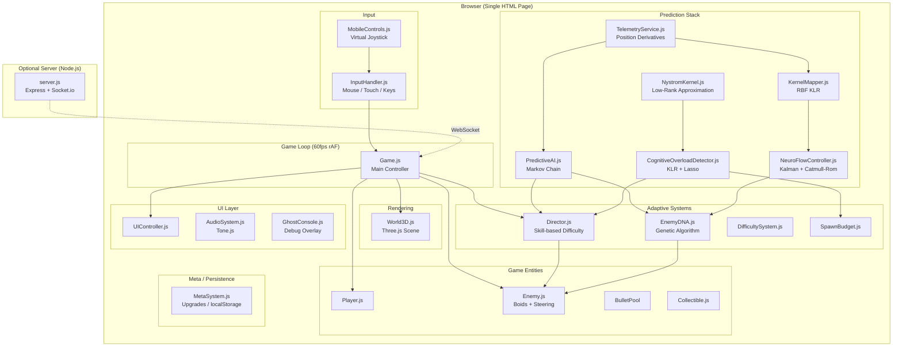
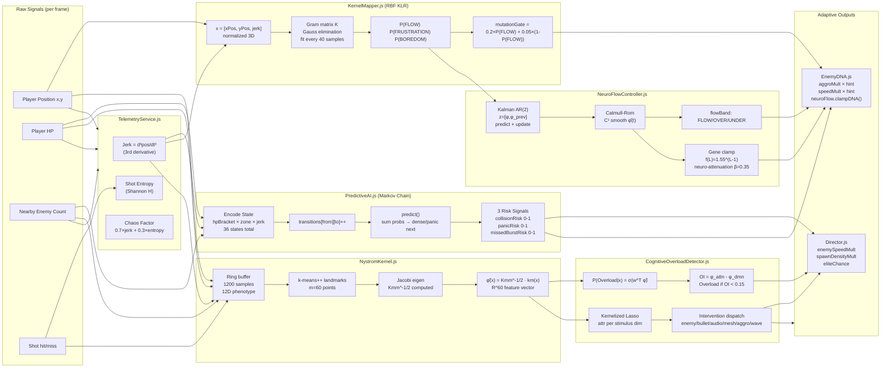
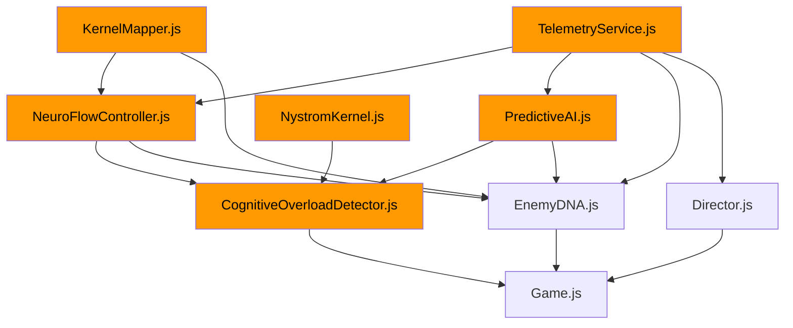
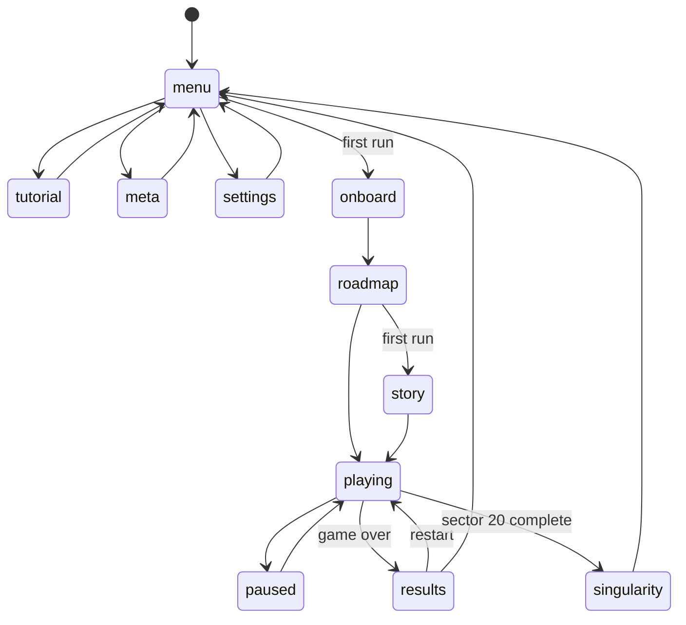

# Architecture Document — SpaceLumin / Lumin Flow
**Date:** 2026-07-18 | **Branch:** crytek-project-audit

---

## System Overview

SpaceLumin is a browser-native 3D space survival game built without a game engine.
Its defining technical feature is a multi-layer prediction-and-adaptation AI stack
operating in real time alongside the game loop.

---

## High-Level Architecture Diagram



---

## Prediction Data Flow Diagram



---

## Repository Map (Concise)

```
SpaceLumin/
├── index.html          HTML shell — all script tags, all UI overlays
├── styles.css          19 KB — UI styling
├── sw.js               PWA service worker
├── manifest.json       PWA install metadata
│
├── js/                 Game source (32 files)
│   ├── GAME SYSTEMS
│   │   ├── Game.js (1374 ln) — main controller, game loop
│   │   ├── World3D.js       — Three.js scene
│   │   ├── Player.js        — player entity
│   │   ├── Enemy.js         — enemy + Boids AI
│   │   ├── InputHandler.js  — all input
│   │   └── UIController.js  — all UI
│   │
│   ├── PREDICTION STACK (the original contribution)
│   │   ├── TelemetryService.js    — raw signal extraction
│   │   ├── PredictiveAI.js        — Markov chain (CORE)
│   │   ├── KernelMapper.js        — RBF KLR flow classifier
│   │   ├── NeuroFlowController.js — Kalman AR(2) bridge
│   │   ├── NystromKernel.js       — low-rank kernel approx
│   │   └── CognitiveOverloadDetector.js — KLR + Lasso
│   │
│   ├── ADAPTIVE SYSTEMS
│   │   ├── Director.js      — skill-based difficulty
│   │   ├── EnemyDNA.js      — genetic algorithm
│   │   └── DifficultySystem.js
│   │
│   └── TOOLS (should be in tools/)
│       ├── headless_orchestrator.js
│       ├── mcp_server.js
│       ├── static_server.js
│       └── GhostConsole.js
│
├── server/             Multiplayer backend (optional)
├── icons/              PWA icons (9 sizes)
└── telemetry_factory/  Synthetic data (1000+ JSONL, ~86 MB)
```

---

## Module Dependency Graph



*Orange = prediction stack modules*

---

## State Machine (Game States)



---

## Game Loop Timing

```
requestAnimationFrame (target: 60fps = 16.67ms)
├── dt = THREE.Clock.getDelta()
├── Update all entities (Player, Enemy, Bullet, Collectible)
├── Telemetry.recordPosition() [per frame]
├── [Every 50ms] CognitiveOverloadDetector.update()
│   ├── NystromKernel.observe()
│   ├── KLR predict → overloadProb
│   └── If overload gate: Lasso + intervention
├── [Every 1s] Director.update()
│   ├── PredictiveAI.predict() → 3 risk signals
│   └── Adjust: enemySpeedMult, spawnDensityMult, eliteChance
├── [Per spawn] EnemyDNA.spawnNextGenDNA()
│   ├── PredictiveAI.getEnemyHint() → aggroMult, speedMult
│   └── neuroFlow.clampDNA() → final gene pass
└── world3D.render()
```
