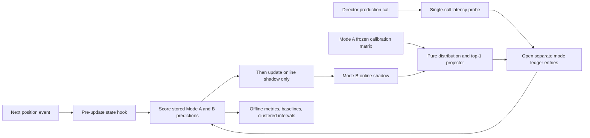

# PredictiveAI Evaluation Design

## Scope and evidence basis

This design measures the currently active `PredictiveAI` path without changing its state encoding, thresholds, learning rules, call cadence, or consumers. It is based on `js/PredictiveAI.js`, `js/TelemetryService.js`, `js/Game.js`, `docs/PREDICTION_RUNTIME_TRACE.md`, and `docs/DEBUG_OVERLAY.md` at commit `6f047ae`.

The design separates two questions:

1. **State-forecast accuracy:** how accurately the existing Markov transition row identifies the next encoded position state.
2. **Runtime cost:** how long the already-required production call to `predictiveAI.predict()` takes.

The current public `predict()` result does not contain a state ID. It returns collision, missed-burst, and panic risks. Therefore, `predictedNextState` below is a precisely defined evaluation projection of the model's existing transition distribution, not a newly claimed production API output.

## Prediction semantics

### Encoded behavioural state

Each `position` event is encoded as:

```text
state = hpBracket * (ZONE_LEVELS * JERK_LEVELS)
      + zoneBracket * JERK_LEVELS
      + jerkBracket
```

The configured dimensions are:

| Component | Values | Source and boundaries |
|---|---:|---|
| HP bracket | 0-3 | `playerHP / playerMaxHP`: `<= 0.25`, `<= 0.50`, `<= 0.75`, otherwise 3 |
| Zone bracket | 0-2 | nearby enemies: `<= 2`, `< 6`, otherwise 2 |
| Jerk bracket | 0-2 | jerk magnitude: `< 200`, `< 800`, otherwise 2 |
| Total nominal states | 36 | `4 * 3 * 3` |

`Game.updateGame()` currently calls `telemetryService.recordPosition(x, y, gameTime)` without HP, maximum HP, or nearby-enemy arguments. Telemetry consequently supplies `100`, `100`, and `0`. In the verified runtime, HP is therefore fixed at bracket 3 and zone at bracket 0. Only states 27, 28, and 29 are genuinely reachable through the live input path, corresponding to calm, active, and panic jerk. A report must not imply that all 36 dimensions were exercised.

### Transition recording

For every playing frame, Telemetry forwards one position event to `predictiveAI.recordEvent('position', data)`. The method:

1. encodes `currentState`;
2. increments `transitions[lastState][currentState]` when a previous state exists;
3. increments `totalTransitions`;
4. assigns `lastState = currentState`.

A frame with the same state as the preceding frame records a self-transition. The word "transition" in the current implementation therefore means a transition between adjacent position observations, not necessarily a change of state.

`feedPositiveVector()` can also add five synthetic counts from the current state to its safe/calm state. Those counts are not observed next-frame outcomes and must be tagged as synthetic training mutations. Also, neither PredictiveAI nor Telemetry is reset by normal `Game.startRun()`, so an uncontrolled matrix can span runs.

### Live learning order and persistence

The shipped predictor continues learning during ordinary play. In each playing frame, `Game.loop()` calls `updateGame()` before `this.director.update(time)`. `updateGame()` calls `telemetryService.recordPosition()`, which immediately increments the previous-to-current transition count and assigns `lastState`. Only after that frame update can Director's one-second gate call `predict()`.

The resulting order at a production prediction opportunity is:

1. observe the current frame's encoded state;
2. add the already-observed previous-to-current transition to the live matrix;
3. call `predict()` using that updated matrix;
4. observe the next frame's encoded state later.

The previous-to-current transition is legitimate history available when the prediction is made. The subsequent current-to-next outcome used to score that prediction has not yet occurred, so it cannot influence the stored prediction if the row distribution and top-1 result are captured at call time. When the next position event arrives, the existing code immediately adds that outcome to the live matrix. A prequential evaluator must therefore score the stored prediction before allowing or mirroring that increment in its evaluation model.

Normal run boundaries do not call `predictiveAI.reset()`. Transition counts, `lastState`, risk EWMs, and shot history can persist into later runs within the same page lifetime. `feedPositiveVector()` mutates the same `transitions` matrix used by `predict()` and adds five to `totalTransitions`; it is not a separate model. Consequently, an uncontrolled evaluation run is adaptive, cross-run, and potentially mixed with synthetic reinforcement.

### Existing prediction distribution and top-1 projection

After at least `MIN_TRANSITIONS = 20`, `predict()` reads the row for the currently encoded state. For row counts `C[i,j]`, its implied next-state distribution is:

```text
p(j | i) = C[i,j] / sum_k C[i,k]
```

The evaluation-only top-1 projection is:

```text
predictedNextState(i) = argmax_j p(j | i)
confidence(i) = max_j p(j | i)
```

The only permitted value for the event's required `confidence` field is the normalized row probability assigned to `predictedNextState`. It is a deterministic projection of genuine transition counts, not a new confidence signal and not a calibrated estimate; when no row exists it is `null`. Ties must be resolved before testing by selecting the lowest numeric state ID and recording a `tie=true` diagnostic. Changing the tie rule after seeing evaluation results is prohibited.

No state prediction is available when the model has fewer than 20 total transitions or the selected current-state row has a sum of zero. The neutral risk object returned by `predict()` in those cases is not a state forecast.

### What the production risk outputs mean

| Output | Current computation | Forecast or description | Objective evaluation now |
|---|---|---|---|
| `collisionRisk` | EWM of probability mass for next states whose zone bracket is 2 | Intended forecast | No genuine collision evaluation: zone input is permanently default-safe and no collision target is paired with the call |
| `panicRisk` | EWM of probability mass for next states whose jerk bracket is 2 | Next-state forecast, modified by call-dependent smoothing | A next-frame panic/non-panic target exists; calibration would require Brier/log-loss analysis and strict isolation of production calls |
| `missedBurstRisk` | EWM of current `recentMisses / SHOT_WINDOW` | Descriptive rolling miss score despite its name | No forecast accuracy until a future shot horizon and a burst outcome are defined |

Calling `predict()` mutates all three EWM fields. Director calls it about once per second, while localhost diagnostics can call it every 100 ms. Accuracy instrumentation must never call it an extra time, and production-risk evaluation must exclude or prevent diagnostic polling.

Production prediction is therefore neither once per playing frame nor once per state transition. It is time-gated by Director and may be called repeatedly while the encoded state remains unchanged. Diagnostic calls can also occur between two adjacent position observations, so multiple calls can otherwise be paired with the same eventual next-frame state. The lifecycle below tags call ownership and deduplicates those cases.

## Ground truth

For the state-forecast task, the exact target is **the encoded state of the first subsequent position event after the eligible production prediction call**. It is not:

- the next distinct state;
- the state one second later;
- a shot result;
- a collision event;
- a Director intervention.

Ground truth becomes known inside the next `recordEvent('position', ...)` observation after the prediction call. A repeated state is a valid self-transition and closes the event with `actualNextState === currentEncodedState`.

This target matches the matrix's adjacent-observation training semantics. A separate "next distinct state" experiment would require excluding or renormalizing self-transition probability and must be labelled as a different algorithm and target.

## Prediction event schema

The durable event record must contain the required fields below. Machine-unavailable values use `null`, never zero or a guessed default.

| Field | Type | Rule |
|---|---|---|
| `eventId` | string | Unique, stable ID, preferably `sessionId:sourceObservationSerial:stateEpochId` |
| `sessionId` | string | New UUID for each controlled run/session |
| `timestamp` | number/string | Prediction-opening timestamp from a monotonic clock; an ISO wall-clock value may be stored additionally |
| `currentEncodedState` | integer | State at production prediction-call entry |
| `predictedNextState` | integer/null | Frozen-row top-1 projection, or `null` when unavailable |
| `actualNextState` | integer/null | First later position state, or `null` while unresolved/censored |
| `correct` | boolean/null | `true` only for an exact state match; `false` for mismatch or a resolved missing prediction; `null` while ground truth is unknown |
| `confidence` | number/null | `p(predictedNextState | currentEncodedState)` from the normalized Markov row, or `null` when no row exists; this is not an invented or independently calibrated score |
| `predictionLatency` | number | Milliseconds spent in the existing production `predict()` call; evaluator overhead is timed separately |
| `currentSector` | integer/null | `window.game.runData.sector` at event opening |
| `gameTime` | number/null | `window.game.runData.time` at event opening |
| `sourceType` | enum | Exactly `human` or `synthetic`; never infer this after collection |
| `algorithmConfigurationVersion` | string | Canonical algorithm/target/deduplication identifier |

The implementation should also retain `modelMode`, the complete normalized `probabilityDistribution`, `status`, `missingReason`, `sourceObservationSerial`, `targetObservationSerial`, `stateEpochId`, `predictionCallOrdinal`, `tie`, `rowTotal`, `modelSnapshotId`, `buildCommit`, `closedTimestamp`, and `censorReason`. These make probability scoring, omissions, and duplicate suppression auditable.

The configuration identifier must change whenever encoding, thresholds, EWM alpha, minimum transitions, shot-window length, top-1/tie rules, ground-truth horizon, or deduplication policy changes. A suitable canonical value for this design is:

```text
pai-eval-v1|states=4x3x3|jerk=200,800|enemy=2,6|min=20|ewm=.3|shots=5|top1=lowest-tie|target=next-position|dedupe=state-epoch
```

Store the source commit and a hash/ID of the frozen calibration matrix separately as `buildCommit` and `modelSnapshotId`.

## Event lifecycle and duplicate prevention

### Observation identity

The future recorder assigns a monotonic `sourceObservationSerial` to each playing-frame position observation. It also maintains `stateEpochId`, incremented only when the encoded state differs from the preceding encoded state. These identifiers are evaluation metadata and must not alter PredictiveAI.

### Opening an event

An event opportunity occurs only when the shipped Director path reaches its existing production `predictiveAI.predict()` call. At call entry, after the current frame's position was recorded and before the next position event:

1. identify the current observation serial and state epoch;
2. reject calls tagged as Ghost Console, overlay, metrics, enemy hint, evaluator, or any other diagnostic source;
3. allow at most one headline event for `(sessionId, stateEpochId, algorithmConfigurationVersion)`;
4. capture the current state, sector, game time, and the selected Mode A frozen row or Mode B pre-outcome online row;
5. normalize and store the full row, then derive top-1 and its row probability without invoking `predict()` again;
6. time the one production `predict()` call with `performance.now()` around its existing invocation;
7. store the event as `open`.

If the model is below warm-up or the row is empty, open the event with `predictedNextState = null`, `confidence = null`, and a precise missing reason. Keeping the opportunity prevents selective reporting of only states for which the model can answer.

### Closing an event

The first position observation with `targetObservationSerial > sourceObservationSerial` closes the event. Set `actualNextState` to that observation's encoded state. Set `correct` to:

```text
predictedNextState != null AND predictedNextState == actualNextState
```

Thus a resolved missing prediction has `correct = false` plus a missing status, while a still-unresolved event has `correct = null`. Mode B must compute this score and all distribution losses from the stored pre-outcome row before its online shadow receives the observed transition.

### Repeated states and repeated calls

- A repeated next-frame state is valid ground truth and may be correct.
- Frames do not open events by themselves; only the production prediction call can do so.
- Only the first eligible production call in a consecutive-state epoch contributes a headline event. Later calls in the same epoch are counted as `duplicateSuppressed`, not samples.
- If several calls occur between the same two position observations, only the first eligible production call may own that target observation.
- Only one event may be open for a given source observation. An unexpected second production call is suppressed and counted.

This policy prevents a stationary or long-lived state and diagnostic polling from creating dozens of nearly identical samples. A secondary call-level analysis may retain every production call, but it must never be mixed with the deduplicated headline dataset.

### Run end, pause, and missing outcomes

- A pause leaves the event open; paused wall-clock time is not gameplay time.
- If play resumes in the same session, the first later position event may close it.
- If the run/session ends first, close it as `censored_run_end`, leaving `actualNextState` and `correct` null.
- Censored events count as unresolved but do not enter an accuracy denominator.
- Invalid encoded states are retained as rejected diagnostics with a reason, not silently discarded.

## Evaluation modes and leakage control

The implementation must keep frozen and adaptive results in separate event streams and reports. A model mode is chosen before a session starts and recorded on every event.

| Model/comparison | State during evaluation | Role |
|---|---|---|
| Frozen calibration Markov model | Immutable calibration transition matrix | Mode A evaluated model and Mode B's fixed reference |
| Online adaptive Markov model | Starts from the declared calibration snapshot and learns only after each stored prediction is scored | Mode B evaluated model |
| Frozen per-state majority baseline | Same frozen rows and `argmax` as frozen Markov top-1 | Equivalence/sanity check only; not independent |
| Global majority baseline | One next-state class fitted on calibration outcomes and then frozen | Independent frequency baseline |
| Uniform random baseline | Fixed uniform distribution over the predeclared valid-state set | Independent chance baseline |
| Previous-state persistence baseline | Always predicts the current state; no fitted transition matrix | Primary independent Mode A baseline |

### Mode A — frozen evaluation

1. Build an immutable Markov transition-matrix snapshot from the declared calibration sessions.
2. Freeze the valid-state set, tie rule, and global-majority state at the same boundary.
3. During evaluation, derive the full probability row and top-1 state only from that snapshot.
4. Never copy evaluation-session transitions or `feedPositiveVector()` mutations into the evaluated snapshot.
5. Compare frozen Markov results with frozen global-majority, uniform-random, and previous-state persistence baselines on identical opportunities.

The shipped singleton may continue learning for gameplay, but its evolving matrix must not replace or mutate the frozen evaluation model. The frozen per-current-state majority baseline uses `argmax_j C_cal[i,j]`, exactly the same operation and matrix as frozen Markov top-1. It is retained only as an equivalence/sanity check. It cannot demonstrate superiority or serve as an independent baseline for that frozen model.

When calibration includes `feedPositiveVector()`, preserve and identify both a shipped-active `mixed-training` snapshot and a human-observation-only shadow snapshot. The selected headline snapshot and mutation count must be declared before evaluation. No evaluation-session mutation may enter either frozen snapshot.

### Mode B — prequential online evaluation

Mode B measures the adaptive Markov learner in strict predict-then-learn order. For every eligible opportunity:

1. normalize and store the online model's current transition row, predicted top-1 state, and top-1 probability using only counts already available;
2. observe the first subsequent encoded state;
3. score the stored prediction and probability distribution;
4. only after scoring, update the online evaluation matrix with that current-to-next transition.

The same outcome must never update the online evaluation matrix before generating the prediction it scores. The hook therefore needs the new state before the existing transition increment, closes/scores the pending event, and only then lets the shadow online matrix learn the transition. Storing the complete probability row at prediction time makes the audit independent of later matrix changes.

The online adaptive model is compared against a calibration-frozen Markov model and the independent frozen/global/persistence baselines. Its events and metrics use a distinct mode label and must not be pooled with Mode A.

To reproduce shipped adaptation, `feedPositiveVector()` mutations may be applied to the online shadow only with their timestamp and weight recorded. A mutation observed while a prediction is pending is queued until that event is scored, then applied before the next prediction opportunity; otherwise it may be applied after its occurrence. This produces a `mixed-training-online` result. A separate human-transition-only online shadow may exclude the mutations, but the two treatments require different model IDs and reports. In neither treatment can a future scored outcome or queued mutation alter the distribution already stored for the event being scored.

### Why leakage-free evaluation is possible

The current runtime ordering does not inherently leak the next outcome into its prediction: the prediction occurs after the current state is observed but before the next state exists. Leakage-free evaluation is possible if Mode A reads only a frozen snapshot, or if Mode B snapshots the distribution before the outcome and scores before updating its shadow model. Reading the live row after the outcome, reconstructing a prediction retrospectively, or allowing cross-run state of unknown provenance would invalidate the result.

Human and synthetic evaluation sessions always use separate ledgers, summaries, and model IDs. Synthetic events cannot increase the human sample count.

## Required baselines

Let `D_cal` be calibration transitions only, `V_cal` the next-state IDs declared valid from calibration/runtime wiring, and `D_eval` the held-out deduplicated evaluation opportunities.

### 1. Uniform random over valid states

For each event, select each state in fixed `V_cal` with probability `1 / |V_cal|`. Its expected accuracy is:

```text
A_uniform = 1 / |V_cal|
```

For the current wired inputs, `V_cal` is expected to be `{27, 28, 29}`, not all 36 nominal states. The set must be frozen before evaluation; deriving it from evaluation outcomes leaks test information. A seeded draw is required if event-level predictions are needed for a confusion matrix.

### 2. Global majority-next-state

Count calibration targets `N_cal(j)` and always predict:

```text
j* = argmax_j N_cal(j)
```

Use the same predeclared lowest-state tie rule. For probabilistic metrics, its companion frozen global-frequency distribution is `q(j) = N_cal(j) / sum_k N_cal(k)`; its top-1 class remains `j*`. This distribution is fitted only on calibration outcomes.

### 3. Per-current-state majority transition

For current state `i`, predict:

```text
j*(i) = argmax_j C_cal[i,j]
```

For a nonempty row, this is mathematically identical to frozen Markov top-1 when both use the same calibration matrix, valid-state set, tie rule, and missing-row policy. A zero-count row remains unavailable for both. The frozen per-state majority result is therefore an equivalence/sanity check, not an independent comparison and not evidence of model superiority. Any difference indicates inconsistent matrices, fallback, tie handling, sampling, or an implementation defect.

### 4. Previous-state persistence

Predict:

```text
predictedNextState = currentEncodedState
```

This is the primary independent baseline for frozen state-forecast accuracy because the target is the next adjacent observation and the data contains many self-transitions. It uses no fitted per-state transition table, directly tests whether the Markov distribution adds value beyond temporal persistence, and is difficult to beat merely by exploiting long state residence. If persistence performs strongly, that may reflect temporal sampling rather than useful anticipation.

For Mode A, compare frozen Markov primarily with persistence, then with global majority and uniform random. Report frozen per-state majority only as the equivalence check. For Mode B, the primary comparator is the calibration-frozen Markov model evaluated on the same opportunities; also report persistence, global majority, and uniform random to retain independent context.

All comparisons use the same eligible events, target horizon, deduplication, calibration split, and censor exclusions as the evaluated mode.

## Metrics and formulas

Let `E` be resolved eligible opportunities, including resolved missing predictions; `P` be the subset with an available prediction; and `I_e` be 1 for an exact match and 0 otherwise.

### Accuracy and coverage

```text
conditional top-1 accuracy = sum_{e in P} I_e / |P|
strict operational accuracy = sum_{e in E} I_e / |E|
prediction coverage = |P| / |E|
total evaluated transitions = |E|
missing predictions = |E| - |P|
unresolved predictions = count(status is open or censored)
```

The conventional top-1 value must never be reported without coverage and strict operational accuracy. In strict accuracy, a resolved missing prediction is incorrect. Baseline comparisons use strict accuracy on the same `E` opportunities.

### Balanced accuracy

For actual classes `K` with held-out support, compute recall per class with missing predictions treated as non-matches:

```text
recall_k = correct predictions with actual class k / events with actual class k
balanced accuracy = (1 / |K|) * sum_{k in K} recall_k
```

List the included classes and support counts. Do not average nominal classes with zero evaluation support.

### Full-distribution probabilistic metrics

Top-1 accuracy cannot distinguish models that choose the same most-likely state but assign different probability mass. For every event with a nonempty row, store the complete normalized transition distribution `p_e(k)` over the fixed valid-state set before the outcome is observed. Mode A obtains it from the frozen calibration row; Mode B obtains it from the online row before scoring/updating.

Let `Q` be the resolved events with a genuine stored distribution, actual state `y_e`, and one-hot target `1[y_e = k]`. A zero-count current-state row produces no distribution and is recorded as a missing prediction; it is excluded from `Q` but included in coverage and strict-accuracy penalties.

#### 1. Impossible-event rate

The untouched model probability assigned to the actual state is `p_e(y_e)`. Define:

```text
impossible-event count = sum_{e in Q} 1[p_e(y_e) = 0]

impossible-event rate = impossible-event count / |Q|

session impossible-event rate(s) =
    count_{e in Q_s}(p_e(y_e) = 0) / |Q_s|

current-state impossible-event rate(i) =
    count_{e in Q_i}(p_e(y_e) = 0) / |Q_i|
```

Report each numerator and denominator as well as the percentage. These measurements use the genuine, unmodified distribution stored at prediction time. A zero remains zero in the event ledger and probability exports.

#### 2. Finite comparison log loss

For numerical comparison only, use the fixed reporting epsilon:

```text
clipping epsilon = 1e-12
p_clipped,e = max(p_e(y_e), 1e-12)

clipped multiclass log loss =
    -(1 / |Q|) * sum_{e in Q} log p_clipped,e
```

Clipping applies only to the scalar probability used by this reporting calculation. It does not modify or smooth the transition matrix, renormalize the stored distribution, choose the top-1 prediction, change coverage, or feed any value back into the model. The original `p_e(y_e)`, including zero, remains stored and drives the impossible-event metrics. Every results export must include `clippingEpsilon: 1e-12` and label the value `clippedLogLoss` rather than raw or production log loss.

An unclipped zero would have infinite per-event log loss and make the aggregate raw mean unusable. The clipped metric keeps model comparisons finite but does not make an impossible event less serious. A low clipped log loss is insufficient evidence of quality when impossible-event rate is high; the two measurements must always be reported together.

#### Other genuine-distribution metrics

Using the unmodified stored distribution, report:

```text
multiclass Brier score = (1 / |Q|) *
                         sum_e sum_k (p_e(k) - 1[y_e = k])^2

mean probability assigned to actual state =
    (1 / |Q|) * sum_e p_e(y_e)
```

Lower clipped log loss and Brier score are better; higher mean actual-state probability is better. Compare these values with the probability distributions produced by applicable frozen baselines. Global majority uses its frozen calibration-frequency distribution, persistence is a point mass on the current state, and uniform random assigns `1 / |V_cal|` to every valid state. Brier score, mean actual-state probability, top-1 prediction, and calibration analysis always use the genuine distribution, never clipped values.

Where sample size permits, add reliability analysis using predeclared probability bins. For top-1 reliability, compare the mean stored top-1 probability in each bin with the observed exact-match frequency; classwise one-vs-rest reliability may also be shown for supported states. Display bin counts and clustered confidence intervals, and omit interpretive claims for sparse bins.

### Baseline improvement

For model strict accuracy `A_model` and baseline accuracy `A_base`:

```text
absolute improvement (percentage points) = 100 * (A_model - A_base)
normalized error reduction = (A_model - A_base) / (1 - A_base)
```

Normalized error reduction is undefined when `A_base = 1` and must be reported as `N/A`. Negative values must be reported unchanged.

### Latency

For production-call latencies `L_1 ... L_n`:

```text
mean latency = sum L_i / n
median latency = 50th percentile of sorted L
p95 latency = sorted L at nearest-rank index ceil(0.95 * n)
```

Report ready-model and warm-up calls separately. Also report evaluator overhead separately so it cannot be attributed to PredictiveAI.

### Grouped accuracy

For current state, sector, or session group `g`:

```text
accuracy_g = correct resolved opportunities in g / all resolved opportunities in g
```

Use the sector and session captured at prediction opening. Every grouped result must include its denominator, missing count, and confidence interval.

### Confusion matrix

Create `M[a,p]`, where rows are actual next states and columns are predicted next states. Add an explicit `NO_PREDICTION` column so missing coverage remains visible. Provide raw counts first; row-normalized percentages are secondary.

For `panicRisk`, if separately approved, use the next state's `jerk === 2` indicator with Brier score and calibration bins. Do not convert a probability to accuracy using an unapproved threshold.

### Statistical uncertainty and small-sample interpretation

- Report 95% confidence intervals for accuracy, paired baseline differences, impossible-event rate, clipped log loss, Brier score, mean actual-state probability, and latency summaries where appropriate.
- Generate primary intervals by bootstrap resampling whole sessions with replacement and retaining all selected transitions within each sampled session. Use at least 2,000 replicates and record the bootstrap seed. Do not resample individual transitions as if they were independent.
- Consecutive transitions from the same run are temporally correlated, even after state-epoch deduplication. Effective sample size is therefore lower than the transition count, and ordinary independent-binomial tests overstate precision.
- Report the complete session-level accuracy distribution: each session's denominator and coverage plus the median, interquartile range, minimum, and maximum session accuracy.
- When multiple participants exist, report participant-level event counts, coverage, strict/conditional accuracy, and probabilistic metrics. Include an unweighted participant macro-average as well as the transition-weighted aggregate. A hierarchical participant-then-session bootstrap is preferred for population claims; session clustering is the minimum.
- Wilson intervals may accompany a single overall proportion as a descriptive check, but they do not address within-session or within-participant dependence and are not the primary uncertainty estimate.
- Fewer than 30 resolved events is a smoke test only, not an accuracy claim.
- Per-state and per-sector rates with fewer than 20 events show counts only; 20-49 are exploratory; at least 50 is preferred before interpreting a rate.
- Balanced accuracy is unstable when any included class has fewer than 20 actual events.
- Reliability bins require their counts and clustered intervals; merge or omit sparse bins according to a rule fixed before evaluation.
- A p95 latency estimate should have at least 100 measured production calls; 1,000 or more is preferred.
- Confusion-matrix counts remain useful with small samples, but normalized cells can be misleading for rare rows.

## First human evaluation protocol

### Environment

- Use one pinned build, algorithm configuration ID, calibration snapshot ID, browser version, device class, and display refresh configuration.
- Use a production-like host where Ghost Console or other diagnostics do not poll `predict()`. The evaluator must observe the existing Director call, not create calls.
- Keep the tab foregrounded. Record pauses, visibility loss, frame-rate degradation, run endings, and censored events.
- Do not activate KernelMapper, NeuroFlow, Cognitive Overload, Director outputs, or optional server/headless paths.

### Calibration split

Collect at least four calibration sessions of at least eight active gameplay minutes each, one for each declared style below. Build and freeze calibration matrices before opening any evaluation session. Initialize the Mode B online shadow from the declared frozen calibration snapshot, and record whether that snapshot is human-only or mixed-training. Calibration events are never included in reported evaluation metrics.

### Evaluation split

Collect at least 12 new human evaluation sessions, each with at least eight active gameplay minutes, and at least 1,000 resolved deduplicated opportunities in total. Use at least three sessions per style:

1. steady/precise movement with deliberate firing;
2. aggressive movement with frequent or spray firing;
3. evasive/high-jerk movement with conservative firing;
4. balanced natural play without a forced tactic.

Use at least three participants for any claim beyond a single-player case study. If the 1,000-event minimum or per-class support is not reached, extend collection; do not lower the threshold after inspecting results. Randomize style order where practical and report sector exposure per session.

### Reporting

Produce separate Mode A and Mode B reports, even when both are scored on the same held-out opportunities. Mode A compares frozen Markov primarily with persistence plus global-majority and uniform baselines; its per-state-majority result is labelled an equivalence check. Mode B compares the online adaptive model primarily with the frozen Markov result and also includes the independent baselines.

Every Mode A and Mode B results report must contain:

- impossible-event count and rate, including session and current-state breakdowns;
- clipped log loss labelled as a reporting-only comparison metric;
- `clippingEpsilon: 1e-12`;
- Brier score from the genuine distribution;
- mean genuine probability assigned to the actual state;
- top-1 accuracy and coverage.

Also include clustered 95% confidence intervals, session and participant distributions, denominators, missing/unresolved/censored counts, class and sector supports, raw zero-probability counts, reliability results where supported, and the full confusion matrix. Interpret clipped log loss only beside impossible-event rate; a low clipped value cannot offset frequent impossible outcomes.

If the model is equal to or worse than baseline, state that directly. Do not tune the encoding, tie rule, minimum-transition threshold, deduplication, or session exclusions on the evaluation split. Any later change creates a new configuration version and requires a new untouched evaluation split.

The first protocol remains a technical validation, not evidence of general player benefit: current state inputs collapse to jerk-only states, sessions are correlated within people, Director outputs are not applied to gameplay, and survival/collision outcomes are not measured.

## Synthetic-data separation

- Synthetic replays, bots, telemetry factories, and `feedPositiveVector()` pseudo-counts are never counted as human evaluation events.
- Every session declares `sourceType` before collection.
- Human and synthetic data use separate session ID namespaces, ledgers, calibration snapshots, metrics, and reports.
- Synthetic data may test lifecycle edge cases, tie handling, missing rows, censoring, and latency harness stability.
- A synthetic result cannot be used as evidence of human prediction accuracy, even if its state distribution resembles a human trace.
- If a shipped-active snapshot contains synthetic reinforcement, label it `mixed-training` and report the number and weight of those mutations.

## Recommended evaluator architecture

Implement later as an isolated, dependency-free evaluation subsystem with minimal observation hooks:



Recommended components:

1. **`PredictionEvaluationAdapter`** owns session/config metadata and references existing Game, Telemetry, and PredictiveAI objects. It has no gameplay authority.
2. **Pre-update state observation hook** receives the already-computed encoded state once per position event, assigns serial/epoch IDs, scores pending events, and only then advances the online shadow. It does not call `recordEvent()` or delay the production learner.
3. **Production call probe** wraps the one existing Director-triggered `predict()` invocation, tags its source, measures only that call, and never invokes prediction itself.
4. **Frozen model store** owns the immutable Mode A matrix, valid-state set, global-majority state, and snapshot ID.
5. **Online shadow store** begins from the declared calibration snapshot and accepts each observed transition only after its pending prediction has been scored. It logs any included `feedPositiveVector()` mutation separately.
6. **Pure distribution projector** normalizes a selected frozen or online row, stores the full probability vector, and applies the fixed top-1/tie rule without mutating PredictiveAI or EWM fields.
7. **Event ledger** uses separate Mode A and Mode B append-only records with explicit lifecycle statuses. It records duplicate, missing, rejected, zero-probability, and censored counters.
8. **Offline reducer** computes baselines, accuracy, probabilistic metrics, session/participant distributions, and clustered bootstrap intervals without importing game modules or changing the runtime.

The evaluator should be Game-owned or composed from `window.game`, resolve Director as `window.game.director`, and never use a bare `director` identifier. It must not call any inactive AI update/classification/intervention path. It must not add work to the animation loop beyond the constant-time state hook, and evaluator overhead must be timed independently.

## Exact source fields required

| Required value | Exact source |
|---|---|
| Encoded state dimensions | `predictiveAI.HP_BRACKETS`, `ZONE_LEVELS`, `JERK_LEVELS`, `TOTAL_STATES` |
| State thresholds | `JERK_CALM_THRESH`, `JERK_PANIC_THRESH`, `ENEMY_SAFE_THRESH`, `ENEMY_DENSE_THRESH` |
| Current state | State computed in `PredictiveAI.recordEvent('position')`; `lastState` after assignment is an observable check |
| Frozen transition distribution | Immutable calibration copy of `predictiveAI.transitions` or a human-only calibration matrix |
| Online transition distribution | Evaluator-owned shadow initialized from the declared snapshot and updated only after scoring |
| Warm-up/readiness | `predictiveAI.MIN_TRANSITIONS`, `totalTransitions` |
| Risk configuration | `EWM_ALPHA`, `SHOT_WINDOW`, cached collision/missed-burst/panic fields |
| Position cadence and live jerk | `telemetryService.recordPosition()` and latest `jerkHistory[].j` |
| Session/run status | `window.game.state` and explicit evaluator session state |
| Sector and gameplay time | `window.game.runData.sector`, `window.game.runData.time` |
| Runtime latency | `performance.now()` immediately before and after the existing production `predict()` call |
| Production call ownership | `window.game.director.update()` through `telemetryService.getPrediction()` |
| Synthetic reinforcement | `predictiveAI.feedPositiveVector()` target row, safe-state column, weight 5, and call timestamp |
| Build identity | Current Git commit supplied when the evaluation build is produced |
| Data provenance | Explicit session configuration: `human` or `synthetic` |

## Risks of misleading evaluation

1. Treating risks as an emitted state prediction would misrepresent the current API; top-1 is a documented projection.
2. Counting every playing frame would create large, correlated, self-transition-heavy samples and misleadingly high accuracy.
3. Using the next distinct state as ground truth would silently change the algorithm's target.
4. Uniform random over all 36 nominal states would be unfair while only three states are wired live.
5. Building baselines or valid-state sets from evaluation outcomes would leak test information.
6. Allowing evaluation outcomes to update the headline matrix would invalidate holdout claims.
7. Ignoring missing predictions would inflate conditional accuracy; coverage and strict accuracy are mandatory.
8. Diagnostic calls change EWM risks and can distort both output values and call counts.
9. `feedPositiveVector()` and cross-run singleton persistence can contaminate provenance unless recorded and frozen explicitly.
10. Frame rate affects the learned transition counts and jerk derivative stream; device/session metadata matters.
11. Rare state and sector results can look extreme from tiny denominators.
12. Accuracy from one person or one forced style does not establish population performance.
13. Good state accuracy does not prove gameplay benefit because Director multipliers are currently unconsumed.
14. Presenting frozen per-state majority as an independent baseline would double-count the same Markov top-1 rule.
15. In Mode B, updating the online row before storing/scoring its prediction would let the target influence the model being assessed.
16. Reconstructing probability rows after outcomes, omitting the impossible-event rate or declared clipping epsilon, using clipped values for prediction, or treating correlated transitions as independent would understate uncertainty.

## Remaining limitations and unavailable ground truth

The following cannot currently receive a valid headline accuracy claim:

- genuine collision-risk forecasting;
- HP-bracket or enemy-density prediction under live gameplay inputs;
- missed-burst forecasting without a future shot horizon and burst definition;
- prediction-driven gameplay benefit or intervention success;
- Kernel flow classification, NeuroFlow state, overload probability, stimulus attribution, or adaptive interventions;
- causal accuracy of Director adjustments, because those outputs are not applied.

`panicRisk` has a potential next-frame binary target, but its probability calibration must be designed separately and isolated from diagnostic calls. The top-1 state evaluation currently measures mostly jerk-state persistence/change among states 27-29, not the full intended 36-state behavioural model.

## Decision for the first implementation

Implement **both modes and publish them as separate reports**.

- Mode A is the primary controlled accuracy report. Its immutable calibration snapshot prevents evaluation outcomes, cross-run learning, and evaluation-session `feedPositiveVector()` mutations from altering the assessed model. Previous-state persistence is its primary independent baseline; global majority and uniform random provide additional context, while frozen per-state majority is only an equivalence check.
- Mode B is the primary adaptation report. It answers whether predict-then-learn updates improve or degrade performance relative to the same frozen calibration model while enforcing score-before-update order.

Both modes can observe the same eligible human opportunities through isolated frozen/online shadow state, but their events, model IDs, metrics, confidence intervals, and conclusions must remain separate. Implementing only Mode A would not measure the shipped system's continuing adaptation; implementing only Mode B would make it harder to distinguish genuine adaptation from changing training history. The paired, separately reported design provides the cleanest first evaluation without changing production prediction thresholds or gameplay behavior.
