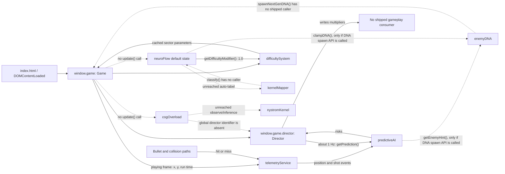

# Prediction and Adaptive-AI Runtime Trace

## Scope and evidence standard

This trace describes the browser runtime loaded by `index.html` at baseline commit `99144aa`. It is based on static call-site inspection of the requested modules and their direct consumers, followed by a non-invasive localhost run. The runtime check confirmed successful game initialization, constructor logs for `NeuroFlowController` and `CognitiveOverloadDetector`, and a live Ghost Console whose Kernel, NeuroFlow, and Cognitive Overload panels remained at their constructor defaults. No `KernelMapper` fit log or cognitive intervention log occurred.

“Active” below means that a method is reached by the shipped `index.html` browser path, not merely that a script is loaded or a constructor runs. Comments that claim a caller exists are not treated as evidence when there is no call site.

## Executive finding

The genuine live path is:

1. `window.game` owns a `Director` instance.
2. During `playing`, `Game.updateGame()` records position telemetry every animation frame.
3. The global lexical `telemetryService` forwards each position and shot outcome to the global lexical `predictiveAI`.
4. `predictiveAI` learns Markov state transitions and shot-miss history.
5. `window.game.director.update()` requests risks through `telemetryService.getPrediction()` about once per second.

That path is active, but degraded:

- `Game` supplies only `(x, y, time)` to `recordPosition()`, so `PredictiveAI` receives default HP, max HP, and nearby-enemy values. Its HP bracket stays at full health, its zone bracket stays safe, and genuine collision risk is unavailable.
- `Director` writes adaptive multipliers, but no shipped gameplay path reads those `Director` multipliers. Prediction-driven Director adjustments therefore do not affect play.
- `KernelMapper.classify()`, `NeuroFlowController.update()`, and `CognitiveOverloadDetector.update()` have no caller in the shipped browser loop.
- All requested modules are instantiated. Several are constructor-active or default-output-only rather than adaptively active.

## Module ownership and lifecycle

| Module | Instantiated at | Runtime owner | Initialization actually called | Runtime update entry | Effective cadence | Status |
|---|---|---|---|---|---|---|
| `Game` | `index.html:341`, `window.game = new Game()` | `window.game` | Constructor; menu/settings wiring; starts `requestAnimationFrame` | `loop()` and, while playing, `updateGame()` | Animation frame | **Confirmed active** |
| `Director` | `Game.js:37`, `this.director = new Director()` | `window.game.director` | Constructor only; `reset()` is not called at run start | `this.director.update(time)` from `Game.loop()` | Called every frame; internally recomputes every 1 second | **Confirmed executing; outputs unconsumed** |
| `TelemetryService` | `TelemetryService.js:280`, top-level `const telemetryService` | Classic-script global lexical singleton; not Game-owned | Constructor only; `reset()` is not called at run start | `recordPosition()` and `update()` from `Game.updateGame()`; `recordShot()` from hit/miss paths | Position/update every playing frame; metrics recomputed every 0.5 game seconds; shots event-driven | **Confirmed active** |
| `PredictiveAI` | `PredictiveAI.js:284`, top-level `const predictiveAI` | Classic-script global lexical singleton; not Game-owned | Constructor only; `reset()` is not called at run start | `recordEvent()` via Telemetry; `predict()` via Director and diagnostics | Position event every playing frame; shot event per resolved bullet; production prediction about 1 Hz via Director; localhost Ghost Console also calls it every 100 ms | **Confirmed active, with incomplete inputs** |
| `KernelMapper` | `KernelMapper.js:352`, top-level `const kernelMapper` | Classic-script global lexical singleton; not Game-owned | Constructor only | No shipped call to `classify()`; `addSample()` would be called only by the unreachable NeuroFlow update path | No adaptive cadence in shipped browser runtime | **Instantiated/default-only; classifier and training path apparently unreachable** |
| `NeuroFlowController` | `NeuroFlowController.js:398`, top-level `const neuroFlow` | Classic-script global lexical singleton; not Game-owned | Constructor only | No shipped call to `update()` or `onTribeObservation()` | No adaptive cadence; default `getDifficultyModifier()` may be read during difficulty computation | **Conditionally consumed default; adaptive path apparently unreachable** |
| `CognitiveOverloadDetector` | `CognitiveOverloadDetector.js:509`, top-level `const cogOverload` | Classic-script global lexical singleton; not Game-owned | Constructor only | No shipped call to `update()` | No runtime cadence beyond diagnostic reads of constructor state | **Instantiated; overload and intervention path apparently unreachable** |

Top-level `const` declarations in classic scripts share the browser’s global lexical environment and are visible by identifier to later classic scripts, but they are not equivalent to `window.<name>`. The one explicit public object is `window.game`.

## Runtime call sequence

### Page load

1. `index.html` loads `PredictiveAI.js`, `TelemetryService.js`, `NystromKernel.js`, `KernelMapper.js`, `NeuroFlowController.js`, and `CognitiveOverloadDetector.js` before `Game.js`.
2. Each top-level singleton constructor executes immediately as its script loads.
3. On `DOMContentLoaded`, `index.html` creates `window.game`.
4. `Game` creates `this.director` and starts its animation-frame loop.

### Normal playing frame

1. `Game.loop(now)` calls `Game.updateGame(dt, time)` when `state === "playing"`.
2. `Game.updateGame()` calls `telemetryService.recordPosition(player.x, player.y, runData.time)`.
3. `TelemetryService.recordPosition()` computes derivatives when enough samples exist and calls `predictiveAI.recordEvent("position", data)`.
4. Because `Game` omits `hp`, `maxHP`, and `nearbyEnemies`, Telemetry supplies `100`, `100`, and `0` defaults.
5. `PredictiveAI.recordEvent()` encodes a 36-state Markov state, increments the previous-to-current transition count (including self-transitions), and increments `totalTransitions`.
6. `Game.updateGame()` calls `telemetryService.update(runData.time)` every frame; the method recalculates jerk, entropy, and chaos only after its 0.5-second gate.
7. After `updateGame()`, `Game.loop()` calls `this.director.update(time)` every frame. Director’s one-second gate controls recomputation.
8. On recomputation, Director calls `telemetryService.getPrediction()`, which calls the stateful `predictiveAI.predict()`.
9. Director applies risk thresholds to its own multipliers. No gameplay system subsequently reads those Director multipliers.

### Shot outcome path

- Player shot creation calls `window.game.director.recordShot()`.
- A bullet hit calls `window.game.director.recordHit()` and `telemetryService.recordShot(true, time)`.
- A player bullet that expires or leaves bounds without a hit calls `telemetryService.recordShot(false, time)`.
- Telemetry forwards both hit and miss outcomes to `predictiveAI.recordEvent("shot", { hit })`.

### Missing adaptive sequence

The comments describe a 50 ms pipeline, but the shipped loop does not call it:

1. No call to `neuroFlow.update(nowMs, sector)` exists in `Game`.
2. Therefore `_autoLabel()` never feeds `kernelMapper.addSample()`.
3. No call to `kernelMapper.classify()` exists anywhere in the shipped browser path.
4. No call to `cogOverload.update(nowMs, gameCtx)` exists in `Game`.
5. Therefore `nystromKernel.observe()`, overload inference, stimulus attribution, and intervention dispatch do not run.

The untracked optional `js/headless_orchestrator.js` contains calls to `neuroFlow.update()` and `cogOverload.update()`, but it is not loaded by `index.html` and is not evidence for the committed playable browser runtime.

## Data-flow diagram



Solid arrows are confirmed runtime calls or reads. Dashed arrows are intended, diagnostic, or currently unreachable paths.

## Inputs, outputs, and consumers

| Module | Inputs actually received | Outputs produced | Confirmed consumer | Runtime assessment |
|---|---|---|---|---|
| `Game` | Animation timestamps, input state, entity state, `difficultySystem` parameters | Player/entity updates, run state, position and shot events, Director events | UI, World3D, entity systems, Telemetry, Director | Fully active orchestration root |
| `Director` | Shots fired, hits, time; prediction risks once per second; defaults for survival/reaction/movement because their record methods have no caller | `skillScore`, `enemySpeedMult`, `spawnDensityMult`, `eliteChance`, `hazardFrequency` | No shipped gameplay consumer; Ghost Console also looks for the wrong global identifier | Executes, but adaptive output is inert |
| `TelemetryService` | Live x/y/run time; hit/miss outcomes. HP/max HP/enemy count parameters are supported but not supplied by Game | Position/velocity/acceleration/jerk histories, `jerkScore`, `entropyScore`, `chaosFactor`, playstyle, sample counts | PredictiveAI; diagnostics; EnemyDNA telemetry adaptation only if its spawn API is called | Active; kinematic and shot values are genuine |
| `PredictiveAI` | Live jerk and shot outcomes; default HP=100, maxHP=100, nearbyEnemies=0 | Transition matrix/count, encoded state, EWM collision/missed-burst/panic risks, enemy gene hint | Director consumes risks; EnemyDNA hint consumer has no shipped call chain | Active model; collision dimension is not genuinely instrumented |
| `KernelMapper` | No live classification input. No training samples because NeuroFlow update is absent | Constructor defaults: one-third probabilities, `FLOW` label, 0.10 mutation gate; trained KLR output only after unreachable training/classification | Diagnostic reads; NeuroFlow mutation gate only on unreachable adaptive/DNA paths | Default-only in shipped runtime |
| `NeuroFlowController` | No tick, no TRIBE observation. Constructor state only | Default phi=0.5, `FLOW`, diff=1.0, spawn=1.0, aggro=1.0; adaptive values would require `update()` | DifficultySystem can consume default diff=1.0; DNA clamp path has no shipped caller | Default output can be read; adaptive values are unavailable |
| `CognitiveOverloadDetector` | No `gameCtx`, no telemetry/stimulus capture, no tick | Constructor overload/index/attribution defaults only | Diagnostics only; intervention dispatch is unreachable | Adaptive outputs unavailable |

## Confirmed active modules

### Game

- Browser initialization logged success.
- `requestAnimationFrame` drives `loop()`.
- `updateGame()` is reached only in the `playing` state.
- The future adapter can safely use `window.game` as the composition root.

### TelemetryService

- `recordPosition()` and `update()` are directly called by `Game.updateGame()`.
- `recordShot()` has confirmed hit and miss call sites.
- Safe live observations include scalar metrics, history lengths, and the latest derivative vectors.

### PredictiveAI

- `recordEvent("position")` is reached every playing frame through Telemetry.
- `recordEvent("shot")` is reached on resolved hit/miss outcomes.
- `predict()` is reached by the active Director. On localhost, Ghost Console also polls it every 100 ms even while the console is hidden.
- Its transition and shot-window state are live. Its HP and zone dimensions are not live because their inputs are defaulted.

### Director

- It is instantiated as `window.game.director`, not as `director`.
- `recordShot()`, `recordHit()`, and `update()` have shipped call sites.
- `recordDamage()`, `recordKill()`, and `recordMovement()` have no shipped callers, so several skill components remain defaults.
- Its output fields are computed but not consumed by spawning, enemy speed, or the committed `DifficultySystem` path.

## Conditionally active or default-only modules

### NeuroFlowController

- The constructor definitely runs.
- `DifficultySystem.sectorMult()` reads `neuroFlow.getDifficultyModifier()` when present.
- Because `update()` is not called, that read returns the constructor default `1.0`, not an adaptive result.
- `clampDNA()` is reachable only if `EnemyDNA.spawnNextGenDNA()` is called; no shipped caller exists for that method.

### KernelMapper

- The constructor definitely runs and diagnostic getters are callable.
- Training requires NeuroFlow `_autoLabel()`, which requires the missing NeuroFlow update call.
- `classify()` has no caller. The documented “every 50 ms” classification does not occur.
- Its default mutation gate may be read on otherwise unreachable NeuroFlow/DNA paths.

## Apparently unreachable adaptive modules and paths

### CognitiveOverloadDetector

- The constructor definitely runs, so the module is not “not instantiated.”
- `update()` has no shipped caller, so stimulus capture, Nystrom observation, KLR prediction, overload state changes, LASSO attribution, and interventions are unreachable in normal browser play.
- Diagnostic reads expose only constructor defaults and must not be labelled live overload measurements.

### Other unreachable consumers relevant to this trace

- `EnemyDNA.spawnNextGenDNA()` has no shipped call site, so PredictiveAI enemy hints and NeuroFlow DNA clamping do not reach newly created `Enemy` objects.
- Director adaptive multipliers have no shipped gameplay reader.
- Kernel classification has no caller even if its training buffer were populated.

## Values safe for a future read-only overlay

The adapter must attach an availability state to every field: `live`, `partial`, `default-only`, or `unavailable`. A number without an availability state would be misleading.

| Value | Source | Availability | Notes |
|---|---|---|---|
| Game state, sector, run time, flow, entity counts | `window.game` and `runData` | Live while a run exists | Read plain fields only |
| Telemetry jerk/entropy/chaos/playstyle | `telemetryService` scalar fields plus `getPlaystyle()` | Live after sampling gates | `getPlaystyle()` is read-only |
| Position/velocity/acceleration/jerk sample counts and latest values | Telemetry history arrays | Live | Expose only the latest value/count, not whole arrays |
| Predictive transition count and last encoded state | `predictiveAI.totalTransitions`, `lastState` | Live | Mark model ready only after `MIN_TRANSITIONS` |
| Shot-window length, recent misses, cached EWM risks | PredictiveAI plain fields | Live/partial | Read cached fields; do not call `predict()` from the overlay |
| Director shots fired/hit, accuracy, skill score, last update | `window.game.director` | Partial | Accuracy is live; other skill inputs are incompletely instrumented |
| Director multipliers | `window.game.director` | Live but unconsumed | Label “computed / not applied” |
| Kernel trained flag, support count, train-buffer count | `kernelMapper` fields | Default-only today | These are useful reachability indicators |
| Neuro tick count and last observation timestamp | `neuroFlow` fields | Default-only today | A zero count/timestamp proves no live update/observation |
| Cognitive last telemetry/stimulus presence and training-buffer count | `cogOverload` fields | Default-only today | Null/zero values prove the update path has not run |

## Values that must currently display `N/A`

| Requested value | Why it is unavailable |
|---|---|
| Genuine collision risk | Game never supplies HP/max HP/nearby-enemy inputs; zone is always encoded as safe |
| Live predictive HP bracket or enemy-density bracket | Backing fields contain defaults rather than player/enemy state |
| Live Kernel flow classification/probabilities | `classify()` is never called; cached values are constructor defaults |
| Trained Kernel mutation gate | No live training/classification path exists |
| Live cortical phi, flow band, Kalman estimate/covariance | NeuroFlow `update()` and `onTribeObservation()` are never called |
| Adaptive Neuro difficulty/spawn/aggro adjustments | Only constructor defaults exist |
| Overload probability/index/derivative | Cognitive Overload `update()` is never called |
| Stimulus attribution and pre-warning cause | No capture, fit, inference, or LASSO attribution occurs |
| Last adaptive intervention | No intervention record field exists and dispatch is unreachable |
| Whether a Director risk threshold changed gameplay | Director has no downstream gameplay consumer and records no adjustment event |
| Reaction skill, movement skill, and damage-derived survival skill as live metrics | Their Director record methods have no shipped call sites |
| Enemy DNA adaptation effect | `spawnNextGenDNA()` is not called by shipped enemy creation |

An overlay may show constructor values in a separate “inactive/default” diagnostic section, but must not render them as live measurements.

## Suspected defects

1. **`director` versus `this.director` is a genuine reference defect.** `Game` creates only `this.director`. There is no `const`, `let`, `var`, `window.director`, or `globalThis.director` assignment. Cognitive Overload checks `typeof director` in `_captureTelemetry()` and in its `enemyDensity` and `aggressionMult` interventions, so those branches fall back or no-op even if Cognitive Overload is later wired. Ghost Console also checks `typeof director` and therefore omits the live Game-owned Director.
2. **Three documented tick calls are absent.** `neuroFlow.update()`, `cogOverload.update()`, and `kernelMapper.classify()` are not called by `Game`.
3. **Prediction inputs are incomplete.** `Game` does not pass HP, max HP, or nearby-enemy count to Telemetry, so PredictiveAI’s collision/zone model cannot represent runtime danger.
4. **Director adaptation is inert.** Director’s speed, spawn-density, elite, and hazard outputs are not consumed by `Game`, `Enemy`, or `DifficultySystem`.
5. **Predictive reads are stateful.** `predict()` updates EWM risk fields. `TelemetryService.getMetrics()`, `PredictiveAI.getDebugInfo()`, and `PredictiveAI.getEnemyHint()` call it. Diagnostic polling can therefore change prediction state; on localhost Ghost Console calls `predict()` every 100 ms even when hidden.
6. **Kernel fallback results are not cached.** `_heuristicClassify()` returns a state/probability object, but the untrained branch of `classify()` does not copy that result into `lastState` or `lastProba`. Diagnostics and mutation gating remain at constructor defaults until a trained classification occurs.
7. **Adaptive state is not reset at a normal run boundary.** `Game.startRun()` does not call `reset()` on Director, Telemetry, PredictiveAI, KernelMapper, NeuroFlow, or Cognitive Overload. Cross-run persistence may be intentional for skill estimation, but it is undocumented and inconsistent with reset-method comments.
8. **Director skill telemetry is incomplete.** Damage, kill reaction, and movement record methods are not called, so the aggregate score is partly based on static defaults.
9. **Enemy DNA consumers are disconnected.** `Enemy` construction uses `DifficultySystem` directly and never requests `enemyDNA.spawnNextGenDNA()`.

## Recommended read-only debug snapshot architecture

Implement a single adapter later; do not let the F3 overlay read modules independently.

### Composition and ownership

1. Add a `PredictionDebugSnapshotAdapter` class with no timers and no imports or external dependencies.
2. Construct it after `window.game = new Game()` and inject exact references:
   - `game: window.game`
   - `director: window.game.director`
   - `telemetry: telemetryService`
   - `predictor: predictiveAI`
   - `kernel: kernelMapper`
   - `neuro: neuroFlow`
   - `overload: cogOverload`
3. Store the adapter on the Game-owned debug surface, for example `window.game.debugSnapshotAdapter`. Do not introduce a second Director or copy module state into overlay-owned globals.
4. The future overlay should poll only `adapter.read()` at a modest display cadence such as 4 Hz. The adapter itself must never schedule work.

### Read contract

`read()` should return a newly allocated plain object whose nested records are also frozen, with this shape:

```text
{
  capturedAt,
  game: { state, sector, runTime },
  telemetry: { status, jerkScore, entropyScore, chaosFactor, playstyle, samples },
  prediction: { status, modelReady, totalTransitions, encodedState, risks, inputs },
  director: { status, ownership, metrics, multipliers, consumed: false },
  kernel: { status, trained, supportCount, trainBufferCount, state, probabilities },
  neuro: { status, tickCount, observationAge, phi, band, modifiers },
  overload: { status, updateSeen, modelReady, probability, index, attribution, intervention },
  warnings: [stable defect/status codes]
}
```

Use `null` for unavailable machine values and render `null` as `N/A`. Never substitute zero for unavailable data.

### Activation tests

- Telemetry is `live` when position samples are increasing during `playing`.
- Prediction is `live` when `totalTransitions > 0`; it is `ready` when `totalTransitions >= MIN_TRANSITIONS`.
- Kernel live classification requires evidence of a classification call. With current fields, `trained && supportVectors.length > 0` is necessary but not sufficient; add a monotonic classification counter when implementation is authorized.
- NeuroFlow is live only when `tickCount > 0`; a TRIBE-backed value additionally requires `lastObservationTs > 0`.
- Cognitive Overload is live only when `lastTelemetry !== null` and `lastStimulus !== null`; model-backed probability additionally requires a fitted Nystrom/KLR state.
- Director must be resolved from `game.director`, never from a bare `director` identifier.

### Side-effect prohibitions

The adapter must not call:

- `predictiveAI.predict()`
- `predictiveAI.getDebugInfo()`
- `predictiveAI.getEnemyHint()`
- `telemetryService.getMetrics()` while it proxies to `predict()`
- any `update()`, `record*()`, `classify()`, `addSample()`, `forcefit()`, `clampDNA()`, or intervention method

Instead, it should read cached scalar fields and bounded counts directly, and perform only pure formatting/availability checks. If a needed value does not have a pure cached representation, expose `N/A` until a side-effect-free getter or explicit instrumentation counter is approved.

## Remaining uncertainty

- Static evidence proves the main browser call graph, but it cannot prove whether a future deployment injects external TRIBE observations or calls modules from code not loaded by the committed `index.html`.
- The optional untracked headless orchestrator exercises some missing updates, but is excluded from the playable baseline and was not treated as runtime ownership evidence.
- Predictive risks depend on the learned transition row. Exhaustive risk calibration requires a controlled gameplay trace; this analysis does not modify or instrument the algorithm.
- It is unclear whether cross-run persistence is intended. The existence of reset methods suggests run-boundary reset was contemplated, while Director comments also mention retaining skill across runs.
